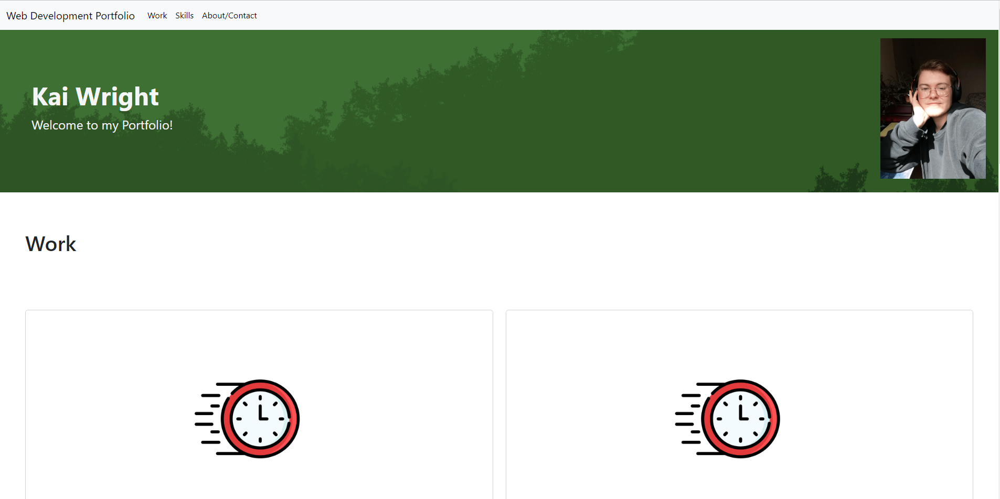
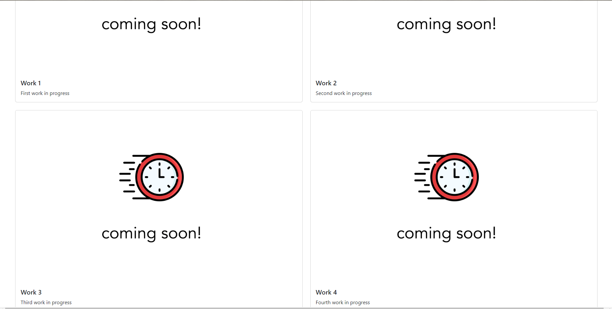
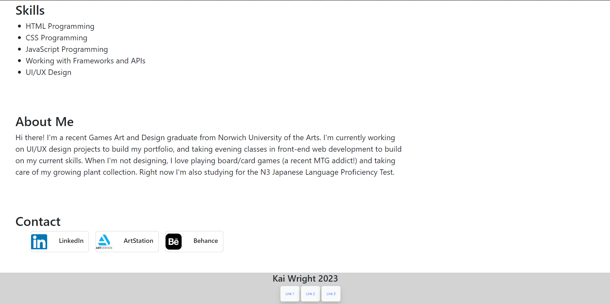

# Bootstrap-Portfolio - Week 3 Challenge

## Description

The aim of this project was to make a new portfolio website to display my future projects as a web developer, using Bootstrap this time. This was done by linking to Bootstrap's stylesheet and using their documentation to enhance my designs. I used the Nav bar, Jumbotron and cards, as well as adapting some of their styling to change different elements much more quickly.
In this project, I got a lot more practice using Bootstrap and modifying it using CSS. 

## Installation

Website deploys at live URL
Link: https://kaiwright.github.io/Bootstrap-Portfolio/

## Usage

The website deploys from the link above. All navigations links take the user to the corresponding section, the work section links are all placeholder links, and in the contact section the links opens my social media pages in a new tab. 

## License

MIT License

## Credits
In this project I used code from Bootstrap
Link: https://getbootstrap.com/ 